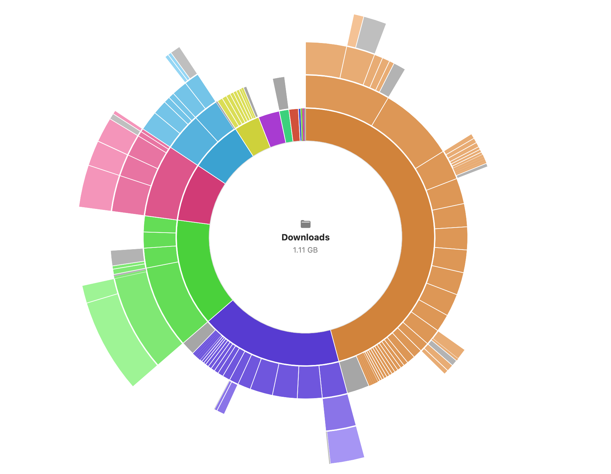

# DiskVis

A native macOS app for visualizing and exploring disk space — and freeing it up.



## Features

- **Two visualizations** — an interactive sunburst (best for structure) and a squarified treemap (best for spotting big files), switchable in the toolbar. Click to drill in, click the sunburst's center to go back up, hover for details, right-click for actions.
- **Sortable file list** alongside the chart, with share bars and modified dates, kept in sync with the chart.
- **Files pane** — the largest files across the whole scan or the current folder, with age filters (6 mo / 1 yr / 2 yr untouched): big *and* old is the safest thing to delete.
- **Search** the scanned tree by name from the toolbar.
- **Collector basket** — gather candidates while you explore (⌘K, right-click, or the detail bar), watch the running total, then move everything to the Trash in one confirmed action.
- **Reclaimables** — one click measures known space hogs: Xcode DerivedData, simulators, npm/pnpm/Yarn/Homebrew/pip/Cargo caches, LM Studio & Ollama models, Docker data, browser caches, iOS backups, and every `node_modules` in the scan — each with a SAFE/CAUTION badge and a plain-English explanation.
- **Snapshot manager** — lists local Time Machine snapshots, explains staged-OS-update space, and deletes TM snapshots on explicit confirmation.
- **Duplicate finder** — size grouping then partial/full SHA-256 hashing; hard links excluded. "Keep newest, collect rest" per group.
- **Scan history & diff** — every scan is saved automatically (compact, compressed, last 10 per root); the Changes pane shows what grew, shrank, appeared, or vanished since any earlier scan.
- **Quick Look** (spacebar) before you delete; **Export** any scan as CSV/JSON from the File menu.
- **Menu-bar watcher** — free-space readout, per-volume bars, a 30-day free-space sparkline, and an optional once-a-day low-space notification (threshold configurable in Settings).
- **Free up space safely** — deletions go to the Trash, always behind a confirmation showing the exact size, with a session "Reclaimed" counter. The chart updates instantly without rescanning.
- **Honest accounting** — deduplicated allocated sizes (hard links once, `du`-exact), synthetic firmlink/alias trees skipped, and the gap between files and Disk-Utility "used" (snapshots, purgeable) stated instead of hidden.

## Build & run

Requires macOS 14+ and Xcode command-line tools.

```sh
make run        # builds build/DiskVis.app and opens it
make build      # just build the .app bundle
make debug      # debug build of the bare executable
```

### Headless / debug flags

```sh
DiskVis --scan <path>                     # scan and print totals (verify against du -sk)
DiskVis --snapshot <path> <png>           # render the sunburst to a PNG
DiskVis --snapshot <path> <png> --view treemap   # …or the treemap
DiskVis --files <path> [--older-days N]   # largest (optionally stale) files
DiskVis --dupes <path>                    # duplicate groups
DiskVis --save-snapshot <path>            # store a history snapshot
DiskVis --diff <path>                     # diff against the latest snapshot
DiskVis --reclaimables                    # measure the reclaimables catalog
DiskVis --snapshots                       # list local TM snapshots
```

## Accuracy

Sizes are **deduplicated allocated sizes** — the same accounting `du` uses (`lstat` block counts), with hard-linked files counted once per scan and each directory inode visited only once. Kernel synthetic aliases of the root tree (`/.nofollow`, `/.resolve`, `/.vol`) and firmlinked mounts (`/System/Volumes`) are skipped so nothing is double-counted.

When scanning a whole volume, the total will be *less* than what Disk Utility reports as used: local Time Machine snapshots, staged OS updates, and purgeable caches occupy space but aren't visible as files to any scanner. The app shows this difference in the status bar rather than pretending files explain everything.

## Permissions

The app is not sandboxed (a sandboxed app can't scan your disk freely) and is ad-hoc signed for local use. Scanning a whole volume or `~/Library` completely requires **Full Disk Access**: System Settings → Privacy & Security → Full Disk Access → add DiskVis. Without it, the scan still completes and the app tells you how many folders it couldn't read.

When scanning `/`, virtual and firmlinked locations (`/System/Volumes`, `/Volumes`, `/dev`) are skipped to avoid double-counting.
